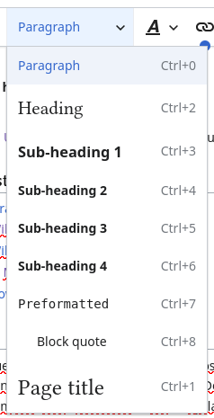

#+TITLE: How to add functionality to MediaWiki's VisualEditor

I have long wanted to extend VisualEditor, but I recently had an excuse to actually do it.

* Adding to the Format menu

The format menu in contains items that will affect “block level” items like headings, blockquotes and paragraphs. To understand how to add our own item here, we'll add an option to center a paragraph on the page.
